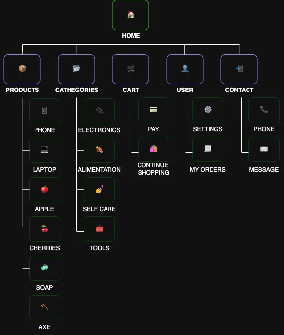

This sitemap represents the navigation structure for an e-commerce website.

  

## 🏠 HOME
- Description: Main landing page for the site.

## 📦 PRODUCTS
-	Description: Displays all available products.
    -	PHONE: Shows the phone specs page.
    - LAPTOP: Shows the laptop specs page.
    -	APPLE: Shows the apples page.
    -	CHERRIES: Shows cherries page.
    -	SOAP: Shows soap page.
    -	AXE: Shows axe page.

## 📁 CATEGORIES
-	Description: Groups products by type.
    -	ELECTRONICS: Phones, laptops, and gadgets.
    -	ALIMENTATION: Food items like apples, cherries.
    -	SELF CARE: Personal care items like soap.
    -	TOOLS: Tools like axes.

## 🛒 CART
 - Description: Manages the shopping cart.
    -	PAY: Page to process payment.
    -	CONTINUE SHOPPING: Redirect back to shopping.

## 👤 USER
- Description: User account management.
  - SETTINGS: User profile & preferences.
  - MY ORDERS: Order history and tracking.

## 📞 CONTACT
- Description: Contact and support options.
  - PHONE: Phone support contact.
  - MESSAGE: Form to send a message or email.
